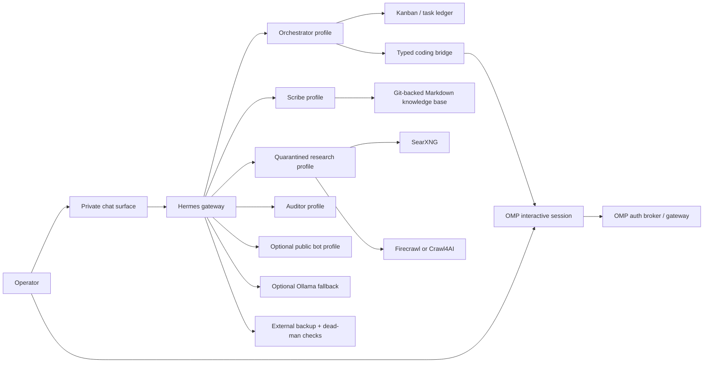
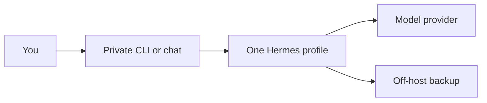

# Hermes Stackbook

> A field-tested, self-hosted Hermes Agent architecture with optional Oh My Pi integration

[](#support-the-project)

This is a build and operations guide for people who want useful AI agents on infrastructure they control—not another demo that stops at a chatbot reply.

**New here? Three ways in:**

| If you want to… | Go to | Time |
|---|---|---|
| Understand what this is, in plain language | [Core concepts](docs/core-concepts.md) | 15 min, no setup |
| Try it without risking anything you own | [Try it safely](docs/safe-sandbox.md) | 30 min, disposable |
| Plan something you intend to keep | [Reading order](#reading-order) below | Half a day upward |

Unfamiliar word? The [glossary](docs/glossary.md) defines only the terms this guide uses in a
specific way.

## In one minute

**Hermes** is a long-running private assistant service: it stays up, so it can hold a
conversation over days, run something on a timer, remember context, and reach you through the
command line or a chat app. A **profile** is one separately configured assistant — its own
settings, memory, credentials, and allowed tools. **OMP** is optional separate software for
software engineering: point it at a repository and it edits code, runs tests, and uses a
debugger. You do not need it to start — Hermes writes and runs code itself; OMP adds a harness
built around repositories, language tooling, and a debugger.

The smallest useful result is **one private assistant, one model provider, no automation** —
reachable only by you. Everything else in this guide is a capability you add later, together
with the boundary that makes it safe to have.

The core idea the rest of the guide keeps returning to: **instructions are not permissions.**
A persona file changes how an assistant writes; it does not stop it doing anything. Only an
absent tool, an absent credential, a separate OS identity, or a network rule does that.

- [Hermes Agent](https://github.com/NousResearch/hermes-agent) provides always-on messaging, profiles, schedules, memory, skills, plugins, and task coordination.
- [Oh My Pi (OMP)](https://github.com/can1357/oh-my-pi) is an optional software-engineering harness for structured edits, LSP, debugging, browser automation, subagents, and multiple model providers.
- Loopback-only search, extraction, and optional local inference keep routine work available without exposing an agent gateway to the public internet.
- Capability-separated profiles keep public content, private knowledge, coding credentials, and host administration out of the same trust boundary.

The guide distills lessons we learned and ideas we developed while deploying, operating, breaking, repairing, and testing a real self-hosted stack. We studied official source and documentation, agent-harness practice, security guidance, SRE methods, and relevant industry standards; [Sources](docs/sources.md) records the starting evidence. The resulting decisions are opinionated defaults, not commandments. Keep the invariants you need, reject the tradeoffs you do not, and document your own choices.

This repository is independent documentation, not an official Nous Research or OMP project. It describes a reproducible architecture, not a copy of one machine.

This is the first iteration of the Stackbook. Extensions and additional supporting modules, plugins, and skills are in development; they will enter the guide only with a named use case, explicit boundary, and behavioral acceptance evidence.

**Compatibility baseline:** documentation and public sources reviewed 2026-08-14. The [compatibility ledger](docs/compatibility.md) records exact upstream reference revisions and evidence level. Hermes, OMP, models, and free tiers change quickly. Run each installed command's `--help`, verify provider terms, and prefer live behavior over this guide when they differ.

## What you can use this setup for

Start with the capabilities you need; the full stack is not required. Common uses include:

- a personal AI agent that grows and learns with you, keeps its data on your machine for you to review at any time, and lets you use any model provider you choose or switch providers at any point without losing its skills and memories;
- research, web search, page extraction, source comparison, and cited briefings;
- scheduled reports, reminders, inbox or repository triage, audits, backups, and health checks;
- self-evaluation through deterministic guards and behavioral evals, with evidence-backed upgrade proposals delivered for operator review instead of applied automatically;
- coding, code review, debugging, and repository maintenance;
- image generation, voice transcription, text-to-speech, video transcription and summarization, and other provider-backed media tools;
- a durable personal or team knowledge base with memory and sourced updates;
- article summarization, document drafting, classification, and repeatable content workflows;
- browser-assisted data collection and other bounded multi-step automations;
- multiple capability-separated profiles for private operations, research, auditing, and optional public interaction.

Hermes writes and runs code through its own terminal and tool surfaces, so coding does not require OMP. Add OMP when software engineering is a large enough share of the work to want a harness built for it: integrated repository workflow, structured editing, LSP, debugger, browser, session, and delegation features.

The software can operate cheaply, and an existing host plus free model/provider tiers can make the recurring cost effectively zero. Free offerings, quotas, and terms change, and local inference still has hardware and electricity costs. Free and inexpensive models can produce useful results on well-scoped tasks; stronger paid models generally improve reliability and output quality for difficult reasoning, coding, research synthesis, and media generation. Route routine work to economical models and reserve paid models for tasks where the quality difference matters.

## System requirements

These are planning bands, not benchmark promises:

| Deployment | CPU and RAM starting point | Storage | Additional requirements |
|---|---|---|---|
| Hermes with optional OMP clients using hosted models | 2–4 modern cores, 8–16 GiB RAM | 40+ GiB SSD | Linux, macOS, or Windows with Windows Subsystem for Linux 2 (WSL 2); Git, `curl`, SSH client, model-provider access, and an encrypted off-host backup. Add Bun and a coding-provider path if using OMP. |
| Add self-hosted SearXNG + Firecrawl | 4–8 cores, 16–32 GiB RAM | 80+ GiB SSD | Supported container runtime; cap browser and worker concurrency. |
| Add CPU local-model fallback | 8+ modern cores, 32–64+ GiB RAM | Model files plus 50+ GiB free | Measure context, prefill latency, and memory pressure. Local inference is an outage floor, not automatically faster or cheaper. |
| Add GPU inference | Hardware-specific | Model and runtime artifacts | Validate the exact GPU architecture, runtime, quantization, context, and recovery behavior in a shadow service first. |

On Windows, run the entire stack inside the WSL 2 Linux distribution. Native Windows installation is not tested, recommended, or endorsed by this guide, even where an upstream component supports it. Linux with systemd remains the simplest always-on target.

You need one model/provider path for Hermes. Add a separate coding-provider path only if you install OMP. A private messaging bot token is required only if you want chat control. The optional public bot is not a system requirement. Keep administration on loopback or an authenticated private network such as Tailscale/WireGuard.

### Personal-machine privacy warning

> **Warning:** A locally installed agent can potentially read, modify, log, or transmit every file and secret its process identity can access. On a personal machine, that may include private files, browser profiles, SSH keys, cloud credentials, photos, messages, backups, and synced folders. A mistaken prompt, untrusted document, tool defect, or model-provider request can expose information even when disclosure was not intended.

Do not run the stack as your unrestricted daily user or grant it your entire home directory. Prefer a dedicated OS identity or a separate VM/host; give it only allowlisted working directories, required sockets, and least-privilege filesystem permissions. Keep secrets outside readable workspaces, separate public or web-facing agents from private knowledge, coding credentials, and administration, and sandbox tools that process untrusted content or execute code.

A profile, container, WSL distribution, or sandbox is only a boundary for resources it cannot reach: mounted home directories, forwarded credentials, shared sockets, and broad host permissions defeat the separation. Before using real personal data, test access as the running identity, inspect every enabled tool and mount, review each outbound provider's data-handling policy, and verify that denied files are actually unreadable. If you cannot make that boundary credible, deploy on a separate machine or VM instead of your personal workstation.

> **Want to look at this without that risk?** Start in a disposable virtual machine:
> **[Try it safely, then throw it away](docs/safe-sandbox.md)** gives one recommended option,
> the five things that must be true before you install anything, a bounded 30-minute trial,
> and how to destroy it afterwards.

## Free and low-cost starting points

Terms, catalogs, quotas, data policies, and availability change. Treat these as leads, verify the primary page on the day you configure them, and keep provider-diverse fallbacks:

A no-cost or low-cost deployment is a valid starting point, not merely a trial mode. Match the model to the task, measure the results you care about, and upgrade selectively when a paid model demonstrates a useful quality or reliability gain.

| Provider or program | What it offers | Important boundary |
|---|---|---|
| [Hetzner experimental Inference API](https://docs.hetzner.com/general/company-and-policy/experiments/inference/) | Free experimental OpenAI-compatible inference and high token limits during the experiment. | Explicitly experimental, no production guarantee or SLA; current model catalog may change without notice. |
| [OpenRouter Free](https://openrouter.ai/openrouter/free) | A free router and `:free` model SKUs behind one OpenAI-compatible API. | Models and rate limits churn; the router may hide which model served a request unless your client records it. |
| [NVIDIA API Catalog](https://build.nvidia.com/models) | Hosted evaluation endpoints and developer credits for NVIDIA models. | Credits and model availability are account/program dependent. |
| [AMD AI Developer Program](https://developer.amd.com/ai-developer-program/) | Free program with time-limited AMD Developer Cloud credits. | This is cloud credit, not a permanent free endpoint; claim expiring credit for a planned experiment. |
| [Google AI Studio](https://ai.google.dev/gemini-api/docs/rate-limits) | Model-specific Gemini API free tiers. | Free-tier data handling and quotas may differ from paid service; review current terms. |
| [Groq rate-limited developer access](https://console.groq.com/docs/rate-limits) | Fast hosted inference with model-specific free developer limits. | Prompt size and per-model token limits can be tighter than an agent's standing context. |
| [Nous Portal](https://portal.nousresearch.com/) | Free-model access through a Nous account when models are offered. | Identity-linked service; do not route private content there unless its current data policy fits your deployment. |

## What this guide delivers

A reader should be able to:

1. choose a single-host deployment size and trust model;
2. install and verify Hermes, plus OMP if its dedicated engineering workflow is needed;
3. create capability-separated Hermes profiles;
4. add private search, page extraction, backups, and optional local inference;
5. select a safe Hermes-to-OMP boundary and use the separate reference broker when that integration is needed;
6. select skills and plugins from official and community catalogs without installing a marketplace wholesale;
7. operate, update, restore, and test the stack;
8. distinguish the tested/documented core from optional extensions and deferred project work.

It deliberately does **not** include credentials, bot IDs, provider accounts, private plugins, personal role names, host paths, or production data.

## For a real deployment: review first, then use an assistant

This section is the **real-host** path. If you only want to look at the software first, take
[Try it safely](docs/safe-sandbox.md) instead — it needs none of what follows. If you are not
yet sure the architecture is what you want, read [Core concepts](docs/core-concepts.md) first.

An AI assistant is recommended for this guide: it can inspect your live OS, reconcile changing CLI syntax, turn decisions into a phased plan, apply most configuration, and answer questions as they arise. Run a locally installed coding/operations agent rather than relying on a browser-only chat so it can inspect files, make implementation changes, and execute verification on the host. [Claude Code](https://github.com/anthropics/claude-code) and [Codex](https://github.com/openai/codex) are suitable examples. Local access does not replace your review or approval.

1. Manually read this README, especially [System requirements](#system-requirements), [Planning](docs/planning.md), [Architecture](docs/architecture.md), and [Security](docs/security.md).
2. Decide what data may leave the host, which accounts will hold credentials, and whether the optional public bot is wanted at all.
3. Open your locally installed coding/operations agent in a private working directory.
4. Give it the prompt below. Review each proposed phase before allowing system changes, credential work, publication, destructive commands, or service restarts.

Copy-paste prompt:

```text
I want you to first plan, then—only after I approve an implementation phase—help me implement a self-hosted agent stack using this guide:
https://github.com/ghosty-11/hermes-stackbook

Objective:
Build the smallest useful Hermes Agent stack for my host, adding Oh My Pi only if my software-engineering workload benefits from a dedicated coding harness. Expand the stack only after each phase is verified. The optional public bot is out of initial scope unless I explicitly add it.

Done when:
- the chosen architecture and trust boundaries are recorded;
- Hermes works on its real surfaces, and OMP does too if I choose to install it;
- every enabled profile has the intended resolved tools, model, credentials, memory, and ingress;
- supporting services are private, backups restore, and scheduled jobs are observable;
- any Hermes-to-OMP bridge I choose to implement is typed, allowlisted, cancellable, and returns verification evidence;
- every completed phase has a fresh behavioral check and a documented rollback.

Working rules:
1. Read the repository's README, AGENTS.md, SUPPORT.md, and linked documents before proposing changes.
2. Inspect my live OS, hardware, network, installed versions, CLI --help output, and existing changes. Do not assume the example environment matches mine.
3. Start with planning and a phased checklist. Explain material tradeoffs and ask only for decisions that cannot be derived safely.
4. Prefer official installers, configuration, plugins, RPC/SDK seams, and current primary documentation. Do not patch upstream source when a supported seam exists.
5. Use code for deterministic checks and models only for judgment. Keep untrusted web/public content away from privileged tools and credentials.
6. Never request that I paste secrets into chat or store them in the repository. Use the product's supported secret storage.
7. Before each mutation, state the intended outcome, affected files/services, rollback, and verification. Preserve unrelated work.
8. Do not restart services, publish anything, spend money, or perform destructive/irreversible actions without my explicit approval for that action.
9. Run the real acceptance scenario after each phase. Configuration text alone is not proof.
10. If the installed CLI or current official docs disagree with the guide, show the evidence and adapt the plan.

Start by summarizing the architecture in your own words, checking whether my host meets the requirements, and returning the private planning worksheet plus a list of operator gates in chat.

Phase 1 is read-only. Do not install packages, write configuration, create credentials, start or restart services, or alter network or firewall state. Wait for my approval before beginning implementation.
```

Throughout the build, ask the assistant to explain anything uncertain before you approve it. Keep a private deployment record containing your real paths, identities, credential references, model ledger, and verification evidence; do not add that data to this guide.

### Using the architecture with other tools

The architecture is more portable than its product names: always-on orchestration, a separate coding harness, capability-separated profiles, typed handoffs, private support services, single-writer state, and independent verification can be mapped to other agent tools. Ask an assistant to map each role and invariant to the replacement tool before implementing it.

That path is **not tested by this project**. Hermes- or OMP-specific lifecycle, credential, tool-resolution, compaction, cron, and cancellation guarantees may have no direct equivalent. Expect product-specific gaps and add acceptance tests for every substituted boundary.

## Reference architecture



The diagram shows logical roles, not required software. **For your first milestone you need
only the top-left path** — you, a private surface, one Hermes profile, and a model provider —
plus somewhere to back up. Treat every other box as optional and add it later, with the
boundary that makes it safe:



[Core concepts](docs/core-concepts.md) walks one request through that minimum path. Hermes can
run one gateway process per profile—the upstream default—or multiplex selected profiles through
one gateway. Start with separate processes unless process density is a real constraint.

## Reading order

### Core private stack

Complete this path before adding autonomous schedules, public ingress, local inference, or a cross-harness broker.

**Step 0 — before any of it:** if you have not used a system like this, spend 30 minutes on
[Try it safely](docs/safe-sandbox.md) in a disposable VM. It costs nothing to delete, and it
makes every page below concrete instead of abstract.

| Step | Document | Outcome |
|---|---|---|
| 1 | [Architecture](docs/architecture.md) | Understand boundaries, data flows, and topology choices. |
| 2 | [Planning](docs/planning.md) | Choose host size, accounts, network, and cost posture. |
| 3 | [Installation](docs/installation.md) | Install and verify a clean Hermes baseline, then optionally add and independently verify OMP. |
| 4 | [Profiles and models](docs/profiles-and-models.md) | Start with the smallest private role roster and capability matrix. |
| 5 | [Supporting services](docs/supporting-services.md) | Add backup and private access; defer research and local inference unless required. |
| 6 | [Security](docs/security.md) | Apply the threat model and publication controls. |
| 7 | [Operations](docs/operations.md) | Operate logs, updates, backups, restore drills, and incidents. |
| 8 | [Build sequence](docs/build-sequence.md) | Implement the core in reversible phases with exit criteria. |
| 9 | [Verification](docs/verification.md) | Prove the intended boundaries and end-to-end behavior. |

### Extension modules

Add only the module with a named consumer and acceptance scenario:

| Document | Extension |
|---|---|
| [Hermes–OMP broker](https://github.com/ghosty-11/hermes-omp-broker) | Add a typed, allowlisted, cancellable coding broker with its own specification, schema, skill, and acceptance suite. |
| [Skills and plugins](docs/skills-and-plugins.md) | Curate official and community extensions. |
| [Suggested scheduled jobs](docs/scheduled-jobs.md) | Add owned, observable, silent-when-healthy scheduled work. |
| [Supporting services](docs/supporting-services.md) | Add quarantined research, page extraction, or local inference. |

Reference material:

If your agents use an LLM-maintained wiki or another operational knowledge base, copy and
adapt the selected runbooks and templates into it. Keeping them only in this reference
checkout makes them easy to miss during live work. Preserve the Stackbook source and revision,
link each installed copy from the knowledge-base navigation, and revise it around your actual
owners, paths, controls, and field evidence.

- [Proposed wiki structure](docs/knowledge-base-structure.md)
- [Core concepts and one worked example](docs/core-concepts.md)
- [Glossary](docs/glossary.md)
- [Try it safely (disposable evaluation)](docs/safe-sandbox.md)
- [Compatibility ledger](docs/compatibility.md)
- [Sources](docs/sources.md)
- [Template library and usage guide](templates/README.md)
- [Skill drift runbook](docs/skill-drift.md)
- [Extension and file drift runbook](docs/extension-and-file-drift.md)
- [Profile matrix](templates/profile-matrix.md)
- [Profile SOUL templates](templates/profile-souls.md)
- [Hermes–OMP broker schema](https://github.com/ghosty-11/hermes-omp-broker/tree/main/schemas)
- [Deployment checklist](templates/deployment-checklist.md)

Repository policy:

- [AI contributor instructions](AGENTS.md)
- [Issue reports and support](SUPPORT.md)
- [Security reporting](SECURITY.md)
- [Changelog](CHANGELOG.md)

## Design rules

1. **Code for deterministic work; use a model for judgment.** Health checks, backups, locks, counts, and file movement are scripts.
2. **A profile is state separation, not a sandbox.** Restrict toolsets and use an isolated backend or OS identity where filesystem isolation matters.
3. **A persona is not a permission.** `SOUL.md` shapes behavior; resolved tools, platform admission, credentials, and process boundaries control impact.
4. **Untrusted content and privileged tools do not share a turn.** Public messages and web pages go through profiles that cannot execute or write privileged state.
5. **Knowledge is not a task queue.** Use a versioned Markdown store for durable facts and a task ledger/mailbox for work delivery.
6. **Prefer upstream seams.** Use Hermes plugins instead of patching Hermes, OMP RPC/SDK instead of scraping terminal output, and the OMP auth broker before building another credential service.
7. **Install narrowly.** Catalog inclusion is discovery, not a security endorsement.
8. **Verify behavior, not configuration text.** Exercise every profile, surface, fallback, scheduled job, restore path, and integration boundary.
9. **Define the autonomy envelope before execution.** Record what the agent may decide, what it must escalate, what it must never do, and which evidence and rollback path close the work.

## Quick start boundary

Do not begin with six agents and every service. The first safe milestone is:

- one private Hermes profile;
- one configured model and one provider-diverse fallback;
- if dedicated software engineering is required, one OMP interactive coding session in a disposable repository; otherwise, one bounded Hermes coding task;
- keep the optional public bot disabled, with no autonomous cron and no custom plugins.

Advance only after the checks in [Build sequence](docs/build-sequence.md) pass.

## Issue reports and support

Questions, corrections, compatibility reports, and architecture reviews are welcome through [GitHub issues](https://github.com/ghosty-11/hermes-stackbook/issues). Read [Issue reports and support](SUPPORT.md) before posting; reports need current evidence and public-safe examples.

If you want private contact, open an issue containing an email address you are comfortable making public; I may contact you when I get around to it. Do not put the private subject, credentials, logs, or sensitive personal information in the issue.

Supporting packages are separate dependencies: [hermes-omp-broker](https://github.com/ghosty-11/hermes-omp-broker) provides the optional coding boundary, and [hermes-mailbox](https://github.com/ghosty-11/hermes-mailbox) provides optional cross-harness message transport. Review, pin, and test only the packages your workload selects.

## Planned work

This first-iteration roadmap has no promised delivery dates. More extensions, supporting modules, plugins, and skills are in development, but planned work does not become part of the tested stack until its boundary and acceptance scenario are documented:

| Item | Status | Boundary |
|---|---|---|
| Reference Hermes–OMP broker | Separate package | The optional implementation, specification, schema, skill, and acceptance suite live in [hermes-omp-broker](https://github.com/ghosty-11/hermes-omp-broker). |
| Cross-harness mailbox | Separate package | Optional message transport, adapters, schemas, skill, and replay tests live in [hermes-mailbox](https://github.com/ghosty-11/hermes-mailbox). It is not a task ledger or an authority channel. |
| Clean-host golden-path deployment | Deferred | Requires a prepared environment, exact version set, sanitized evidence, and a complete run through the minimum private-stack acceptance scenarios. |
| Measured model-role evaluation | Deferred | Requires a repeatable corpus for tool selection, structured output, citation quality, context retention, latency, and fallback behavior. |
| Compatibility ledger | Active | Each release should add evidence without upgrading source review into runtime proof. See [Compatibility](docs/compatibility.md). |

## Support the project

If this guide saves you time, you find it useful, or you want to help me cover the token costs of continued development, you can support the work with an EVM donation:

```text
0x9600c9bc632175941608a1b551cb0f018f0f40b4
```

Networks: Ethereum, Base, Polygon, and other EVM-compatible networks. Verify the address and selected network before sending; unsupported assets or networks may be unrecoverable.

## License and publication

Licensed under the [MIT License](LICENSE).

<sub>Made with love, with help from AI agents.</sub>
