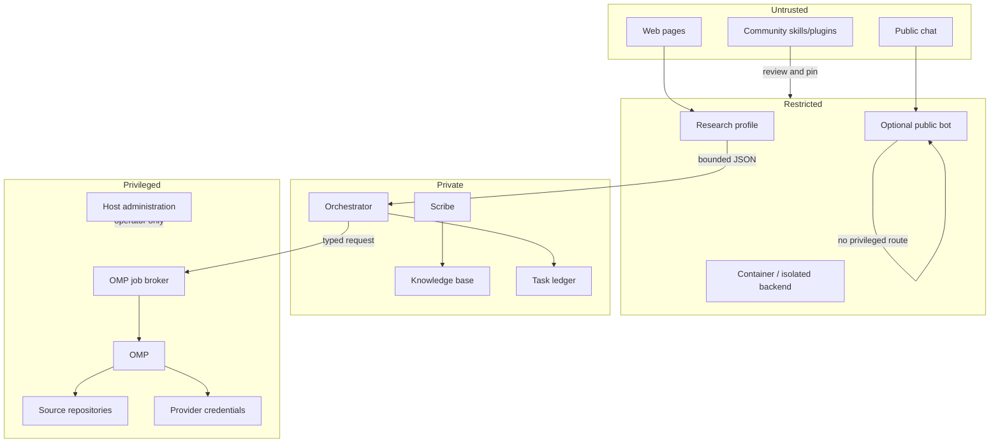

# Architecture

## The split

Hermes and OMP solve different operating problems, but OMP is optional. Hermes is capable of coding through its terminal and tool surfaces. Use Hermes alone for lighter or occasional coding; add OMP when software engineering is important enough to justify a dedicated harness with integrated repository, LSP, debugger, browser, structured-editing, session, and delegation workflows.

| Concern | Hermes | OMP |
|---|---|---|
| Always-on chat and gateway | Primary owner | Not the intended role |
| Scheduled work | Native cron and no-agent jobs | Called only for bounded engineering jobs |
| Multiple long-lived identities | Native profiles | Per-project sessions and typed subagents |
| Durable task ledger | Hermes kanban | Consumes explicit jobs |
| Interactive software engineering | Native coding tools can own the selected scope | Optional dedicated owner when the workload needs OMP's integrated engineering workflow |
| LSP, debugger, browser, structural edits | Some capabilities exist or can be added | Integrated first-class tools |
| Provider credentials for coding subscriptions | Should not be exposed to optional public-facing profiles | Stored locally or behind OMP auth broker/gateway |
| Public or community chat | Capability-restricted profile | Never exposed directly |

When OMP is enabled, keep the boundary intentional. Do not turn OMP into an optional public bot, and do not give an optional public Hermes profile the credentials and filesystem access used by the coding harness.

## Logical components

### Control plane

- **Operator surface:** private Discord, Telegram, Slack, CLI, or Hermes dashboard.
- **Orchestrator profile:** receives requests, decides ownership, updates the task ledger, and calls narrow integrations.
- **Human approvals:** required for destructive commands, credential changes, service restarts, publication, and spending-policy changes.
- **Improvement loop:** guards, evals, audits, and compatibility checks produce evidence-backed proposals for an explicit operator review surface, such as a private inbox or standup channel. The proposing profile cannot approve, install, restart, or publish its own recommendation.
- **External monitor:** checks that the Hermes gateway and backup jobs still run. It must not depend on Hermes being healthy.

### Work plane

- **Scribe module:** optional sole routine writer of a shared knowledge base.
- **Research quarantine module:** optional search/extract profile with no shell or privileged file access.
- **Engineer module:** optional Hermes-native coding tools or, when the workload benefits from a dedicated engineering harness, OMP interactive sessions and bounded jobs from Hermes.
- **Auditor module:** optional read-only evidence gathering and review.
- **Public bot module:** optional smallest tool surface with separate memory and credentials.

These roles describe one workload-specific reference deployment, not a universal roster.
Select only modules with named consumers and acceptance scenarios.

### Data plane

Keep these stores distinct:

| Store | Purpose | Writer policy |
|---|---|---|
| Hermes profile home | Config, credentials, sessions, skills, memory, cron | One profile/process owns each home. |
| Git-backed Markdown knowledge base | Decisions, runbooks, durable facts | One routine writer; human edits are reconciled. |
| Hermes kanban | Work state, ownership, dependencies | Orchestrator plus explicit workers. |
| Coding repositories | Source and tests | One active writer per shared checkout; use worktrees for parallel jobs. |
| OMP session/auth state | Coding sessions and provider credentials | Operator-owned OMP process or OMP auth broker. |
| Backup repository | Recovery data | Backup service only; restore is operator-gated. |

Field caveat: under a **multiplexed** gateway, live conversation sessions for every served
secondary profile persist in the serving (default) profile's state database, tagged with the
profile's name; the serving profile's own rows may carry no profile tag at all. Config,
credentials, skills, memory, and cron still resolve per profile. The secondary profile's own
state file is not empty — standalone CLI runs against that profile home write into it — so
querying it returns *different* sessions rather than none, which is worse than an empty
result because it reads like a complete answer. Probe the serving profile's store, and pair
any negative result with a control string you know is present.

A wiki edit must never silently become a privileged task. A task body must never be injected into every coding session. List metadata first; open untrusted bodies explicitly.

## Gateway topology

Hermes supports two valid layouts.

### One process per profile — recommended starting point

Upstream Hermes uses this as the default. Each profile has an independent gateway service, process, credentials, memory footprint, and crash domain.

Use it when:

- profiles need independent restarts;
- an optional public bot should not share a process with private agents;
- debugging and failure attribution matter more than process count;
- different bot tokens and services are acceptable.

This is process isolation, not OS-user or filesystem isolation. Profiles using the same account and local terminal backend can still reach that account's files unless another boundary prevents it.

### Multiplexed gateway — density optimization

Set `gateway.multiplex_profiles: true` on the default profile to serve selected profiles through one process. Use `gateway.multiplex_profile_allowlist` rather than implicitly serving every installed profile.

Use it when:

- many low-traffic internal profiles make multiple services operationally expensive;
- one restart domain is acceptable;
- shared gateway infrastructure is desirable;
- you have tested every profile's resolved plugin, platform, skill, model, and credential state under multiplexing.

Costs:

- one process is a common crash and restart domain;
- plugin registration and adapter behavior need multiplex-specific verification;
- HTTP-inbound profiles share the listener and use `/p/<profile>/` routing;
- secondary profiles must not bind their own HTTP ports;
- each polling platform still needs a distinct token per profile unless explicit profile routes share a bot.

A practical compromise is a multiplexed private group plus a separate process for the optional public bot, if enabled.

Official references: [Profiles](https://hermes-agent.nousresearch.com/docs/user-guide/profiles/) and [Running Many Gateways](https://hermes-agent.nousresearch.com/docs/user-guide/multi-profile-gateways).

## Trust boundaries

No text classifier turns untrusted content into trusted instructions. The restricted profile's absent capabilities are the primary control; validation and injection scanning are additional controls.

## Integration contracts

Every enabled cross-boundary interface should be narrower than free-form chat:

- **Research result:** JSON object with answer, source URLs, retrieval time, and explicit size limits.
- **Coding job/result:** use the separate [hermes-omp-broker](https://github.com/ghosty-11/hermes-omp-broker) specification and schema.
- **Mailbox message:** use [hermes-mailbox](https://github.com/ghosty-11/hermes-mailbox); messages carry information, not authority.
- **Knowledge handoff:** source, date, confidence/provenance, canonical topic; never raw page text promoted automatically.
- **Operator notification:** named destination and severity; silence on healthy routine checks.

## Failure model

Design for these failures explicitly:

| Failure | Expected behavior |
|---|---|
| Primary provider returns 429/5xx | Try a different provider, then optional local degraded lane. |
| Search or extractor is down | Research fails with a clear dependency status; no fabricated current answer. |
| Quarantine output is malformed | Drop it. Do not forward partial prose. |
| OMP broker is unavailable | Hermes keeps chat/board operation; coding job remains queued or fails visibly. |
| Gateway crashes | Supervisor restarts it; external dead-man alert fires if it stays down. |
| Cron dependency missing | Preflight blocks before model spend. |
| Backup succeeds but restore is broken | Restore drill fails; backup is not considered healthy. |
| Plugin update changes a wrapped upstream seam | Compatibility test fails before deployment. |
| Optional public prompt tries to invoke privileged work | Optional public profile has no route or tool to perform it. |

## Optional modules and remaining custom work

This is the first iteration of the Stackbook. Additional extensions, supporting modules,
plugins, and skills are planned; select only gaps exercised by named use cases:

1. a fail-closed web-research hop between capability-separated profiles;
2. [hermes-omp-broker](https://github.com/ghosty-11/hermes-omp-broker) for typed Hermes-to-OMP coding delegation;
3. [hermes-mailbox](https://github.com/ghosty-11/hermes-mailbox) for listing-first cross-harness messages when the task ledger alone is insufficient;
4. policy checks that compare profile charters to resolved tool schemas;
5. a local-model-aware context/compaction policy when cloud and local windows differ materially;
6. an optional ambient public-chat adapter—such as [ghosty-11/hermes-discord-ambient](https://github.com/ghosty-11/hermes-discord-ambient)—if an enabled public bot should sometimes join a conversation.

Each selected custom piece needs a narrow contract, fail-closed behavior, upstream seam reference, and end-to-end test.
