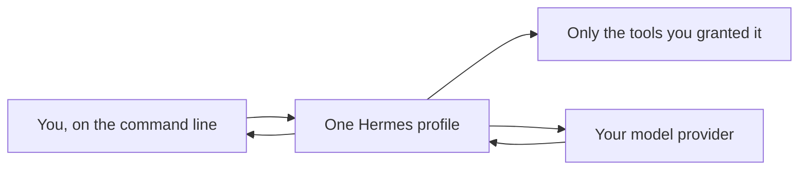

# Core concepts, with one example

For readers deciding whether this project is for them. Fifteen minutes, no setup.
Vocabulary is defined in the [glossary](glossary.md).

## What the two pieces actually are

**Hermes is a long-running private assistant service.** It stays up, so it can hold a
conversation over days, run something on a timer, remember what you told it, and reach you
through a chat app or the command line. Think "an assistant with a service account", not "a
chat window".

**Oh My Pi (OMP) is optional software-engineering software.** You point it at a code
repository and it edits files, runs tests, uses a debugger, and drives a browser. It is a
different job from Hermes and you do not need it to start.

A quick way to tell which you want:

| What you want to do | Which piece |
|---|---|
| "Summarise this document and post it to me each morning" | Hermes |
| "Answer questions privately, over days, remembering context" | Hermes |
| "Watch for a condition and tell me only when it matters" | Hermes (a scheduled job) |
| "Change this code, run the tests, show me the diff" | OMP (or Hermes alone, for light work) |
| "Refactor across a repository with language tooling and a debugger" | OMP |

Hermes can also write and run code through its own tools, so **light coding does not require
OMP**. Add OMP when software engineering is a main workload and you want a harness built for
it.

## Following one request end to end

The smallest useful setup, and what happens when you use it:

1. You ask a question from the command line.
2. The **gateway** hands it to one **profile** — a single configured assistant.
3. That profile can use only the **tools** you gave it. If you never granted shell access, no
   instruction, persona, or clever prompt gives it shell access.
4. It sends the prompt to your configured **provider** and gets an answer back.
5. You get a reply.

That is the whole first milestone. No chat bot, no scheduled jobs, no second profile, no task
board, no research services, no broker. Everything else in this guide is something you add
later, once you want the capability *and* the boundary that makes it safe.

## Why the guide keeps talking about roles

The [reference architecture](../README.md#reference-architecture) shows several profiles with
names like orchestrator, scribe, and auditor. That is a worked example of one deployment, not
a requirement. The idea behind it is worth understanding early, because it explains most of
the guide's structure:

**Separate the things that must not meet.** An assistant that reads untrusted web pages should
not be the same assistant that holds your coding credentials — because anything it reads is
input a stranger may have written. An assistant that talks to the public should not be able to
run shell commands. Splitting them means a mistake in one has nowhere to go.

You do not get this by asking nicely in the instructions. You get it by giving each assistant
a different set of tools and credentials, which is what "capability separation" means
throughout these pages.

## The one idea to take away

**Instructions are not permissions.** A persona file shapes how an assistant writes. It does
not stop it doing anything. What stops an assistant is the absence of a tool, the absence of a
credential, a separate operating-system identity, or a network rule.

Almost every rule in [Security](security.md) and [Profiles and models](profiles-and-models.md)
follows from that one sentence, and it is also why [Verification](verification.md) insists on
testing what the running system *resolves* rather than what a configuration file claims.

## Where to go next

- Want to try it without risking anything? → [Try it safely](safe-sandbox.md)
- Ready to plan something you intend to keep? → [Architecture](architecture.md), then
  [Planning](planning.md)
- Lost in vocabulary? → [Glossary](glossary.md)
