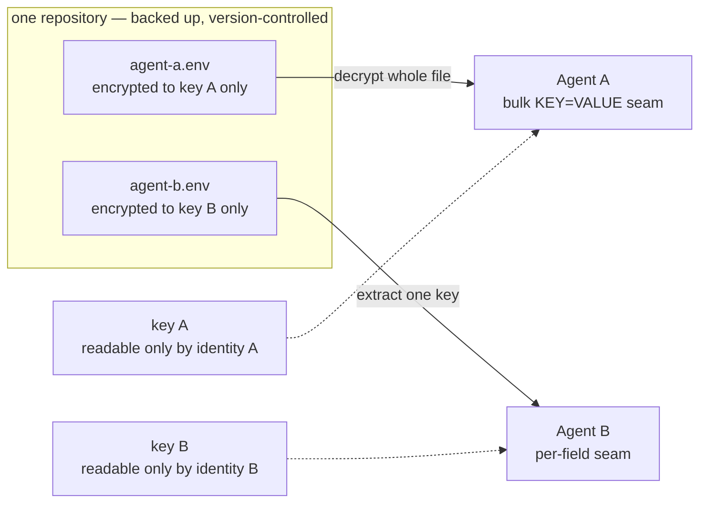

# Central secret store

Two harnesses, several profiles, scheduled jobs and supporting services each need credentials.
Left alone, they accumulate copies: a profile `.env` per seat, a key file beside a model config,
an inline password in a service unit, a token read directly by a helper script. Every copy is a
place to forget during rotation and a place to leak during a backup.

This page describes a store that removes the copies. Read
[Security](security.md) first for what a store cannot do.

## What a store does and does not buy

State this plainly before adopting one, because the common failure is claiming the wrong benefit.

**It buys:** one rotation point, one revocation point, no plaintext at rest, one thing to back up,
and — if the store is a Git repository — a reviewable change history.

**It does not buy a security boundary.** Every design ends with the harness process holding a
usable credential. Whatever key or token unlocks the store must be readable by the identity the
harness runs as, so an agent running as that identity can read it too, or simply invoke the store
CLI itself. A store is credential *hygiene*; the boundary is a separate control — an absent tool,
a container without the mount, a different OS user, a network rule. See
[Core concepts](core-concepts.md).

The practical gain is narrower than "secrets are safe" and still worth having: with plaintext
credential files, an accidental copy — `cp .env .env.bak`, an editor backup, a stray archive —
exposes every secret it contains. With an encrypted store, the same accident produces ciphertext.

## Requirements before choosing

A store is only adoptable if it satisfies the delivery contracts the harnesses already impose.
Establish these against your own installation rather than assuming them.

1. **Per-identity isolation.** If two harnesses run as different OS users that cannot currently
   read each other's credentials, the store must preserve that. One shared encrypted blob readable
   by both is a *regression* in blast radius, not a neutral simplification.
2. **Native seams, no code changes.** Both harnesses can already shell out for a secret. Hermes has
   a command secret source; OMP resolves configuration values prefixed with `!` by running a
   command and using its stdout. Prefer a store whose CLI fits those seams directly.
3. **Two output shapes.** The Hermes command source expects a **complete `KEY=VALUE` map from one
   invocation**; OMP expects **one value per configured field**. A store that only does per-key
   reads needs a wrapper for Hermes; a store that only dumps everything needs one for OMP.
4. **A hard timeout budget.** These seams have fixed timeouts measured in seconds. Measure the real
   command against the real file size; do not assume.
5. **Non-interactive after reboot.** Scheduled jobs run with no human present. Any store needing a
   passphrase, PIN, agent priming or desktop session at unlock time is disqualified unless it has a
   documented unattended path.
6. **Recovery must not be circular.** The material that opens the store cannot live only inside the
   store, and must not live only inside a backup the store's own credential is needed to open.
7. **Backups must be extended deliberately.** Backup source lists are usually allowlists. A new
   store path is unprotected until explicitly added and a restore is tested.

## A design that satisfies them

Encrypted files in one repository, one file per consuming identity, each encrypted only to that
identity's key.

The separation is the point. "Central" means one repository, one rotation procedure and one backup
— **not** one ciphertext that every consumer can open. Verify the isolation rather than trusting
it: attempt to decrypt each file with the other identity's key and confirm a non-zero exit and no
plaintext.

File-based stores fit this shape well. A daemon-based secret manager also works, but for a small
static credential set it adds a service, a bootstrap secret to unlock that service, a bearer token
per client, and a stateful volume with its own restore drill — while landing in exactly the same
place on the boundary question. Choose a daemon when you actually need its distinguishing
features: dynamic short-lived credentials, leases, policy tenancy or a read audit trail. Note that
some open-core products gate audit logging and rotation behind a paid tier; check the licence of
the specific features you are adopting, not the repository's headline licence.

## Migration

Move one credential class at a time and keep the old path working until the new one is proven.

1. **Inventory every reader first.** The harness seams are the visible consumers; they are rarely
   the only ones. Expect service units with an environment-file directive, helper scripts that
   parse a credential file directly, inline passwords in container definitions, and tooling
   credentials in their own config. A migration that covers only the harnesses leaves live copies
   behind, and "rotate once" becomes false.
2. **Do not widen access.** A credential currently readable only by a privileged system identity
   should stay there. Moving it into a store that agent identities can read is a downgrade, even
   though it looks like consolidation.
3. **Prove the seam with a throwaway value.** Populate a test entry, point one configuration field
   at the store, measure the command against its timeout, and confirm the consumer works — before
   any real credential moves.
4. **Migrate, verify, then revoke.** Only after the new path is proven for a given credential
   should the old copy be removed and the upstream credential rotated.
5. **Remove the old plaintext.** Command-resolved values are typically held in memory only, but the
   previous files, database rows and backup copies persist until deleted.

## Rotation

Rotation is not finished when the stored value changes. Long-running consumers commonly cache a
resolved secret for the life of the process, so plan the restarts as part of the procedure.

1. Update the value at the single authoritative point, using a command form that does not put the
   secret in a command line — the process list is world-readable on most systems.
2. Restart or reload each long-running consumer; note which ones share a process, because
   restarting a multiplexed service restarts every profile it serves.
3. Let short-lived consumers — scheduled jobs, socket-activated helpers, new sessions — pick the
   value up on their next run, and verify one of them actually did.
4. Verify every consumer's health check before revoking the previous credential upstream.
5. Revoke upstream last.

Rotating the *store's own* key is a separate operation: add the new recipient, re-encrypt, deploy
and test the new key, then remove the old recipient and re-encrypt again.

Removing a recipient stops it decrypting the *current* revision. It does not reach historical
revisions in version control or backups, and it cannot un-read a secret already read. When a
credential has actually been exposed, rotate the credential itself at the provider; changing store
keys is not a substitute.

## Verification

Prove each of these against the live installation, not the documentation:

- each identity can read its own file and **cannot** read the other's;
- the bulk command emits a complete, correctly parsed map within its timeout;
- the per-key command returns one value within its timeout;
- values containing `=`, quotes, spaces and escaped newlines survive a round trip unchanged;
- rotation changes the intended key and leaves the others untouched;
- a scheduled job reads the store successfully after an unattended reboot;
- a restore from backup, using only material available after host loss, yields a usable store.

Related: [Security](security.md) · [Supporting services](supporting-services.md) ·
[Operations](operations.md) · [Verification](verification.md)
